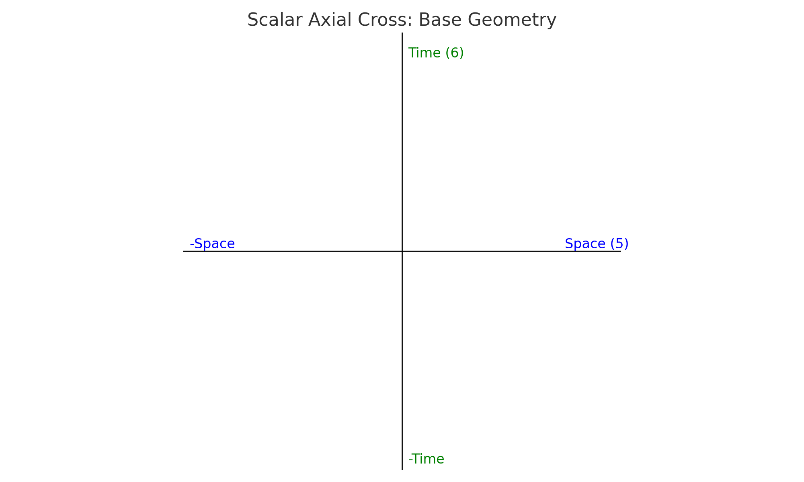
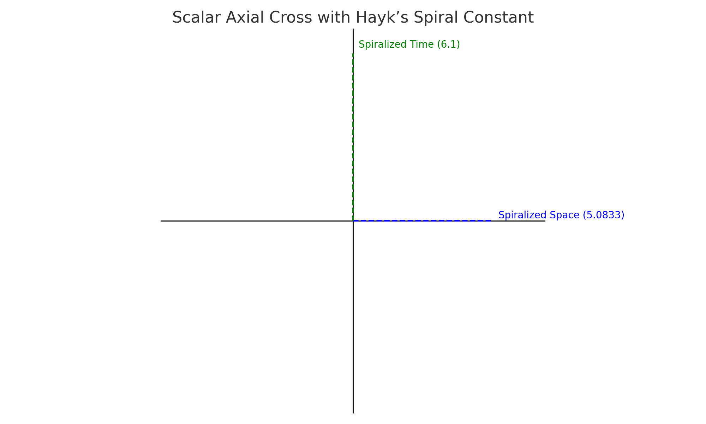

# The Scalar Axial Cross & Hayk’s Spiral Constant

## 1. Introduction

The Scalar Axial Cross is a foundational model within the Haykyan–Scalar cosmology, representing the dynamic intersection of time and space as living, spiral-based vectors. Unlike traditional Cartesian or static mystical crosses, the Scalar Cross is animated by **Hayk’s Spiral Constant**, a mathematical coefficient that encodes the daily sidereal–solar drift and the recursive nature of cosmic time.

---

## 2. Core Components of the Scalar Cross

### 2.1 Vertical Axis – Time (6)

The vertical axis represents **sidereal time**, encoded symbolically by the number 6. This dimension governs cosmic memory, celestial drift, and the upward recursion of awareness.

- Sidereal Day  
- Observer-centric motion  
- Time spiral activation  
- `6 × 1.01666667 = 6.1`

### 2.2 Horizontal Axis – Space (5)

The horizontal axis represents **spatial structure**, embodied in the number 5. It governs solar time, embodied geometry, and horizontal expansion in form.

- Solar Day  
- Structural geometry  
- Material field  
- `5 × 1.01666667 = 5.08333`

---

## 3. Hayk’s Spiral Constant: The Animating Principle

**Hayk’s Spiral Constant** (`1.01666667`) is the ratio that transforms a flat cross into a spiral generator. It encodes the drift between sidereal and solar time and acts as a multiplier that spirals space and time out of stasis into motion.

- Symbolically, it is the *breath of time*  
- Mathematically: `61 ÷ 60`  
- Functionally: bridges static geometry with spiral dynamics  
- Spiral Time: `6 × 1.01666667 = 6.1`  
- Spiral Space: `5 × 1.01666667 = 5.08333`

---

## 4. Spiral Expansion & Dimensional Resonance

The transformation from `6 × 5 = 30` into `6.1 × 5.08333 ≈ 31.008` reveals a crucial insight: **spiralized time-space crosses generate drift**. This drift is not an error — it is the engine of memory, difference, and evolution. Where classical geometry closes, scalar time opens.

---

## 5. Implications in Cosmology and Practice

The Scalar Axial Cross provides a geometric basis for synchronizing:
- Sacred architecture
- Biological time
- Scalar resonance

It redefines dimensionality not as static extension, but as **resonant drift**. It holds potential for:
- Recalibrating artificial calendars  
- Restoring sidereal awareness  
- Developing scalar technologies grounded in organic time

---

## 6. Conclusion

Through the activation of the Scalar Axial Cross by **Hayk’s Spiral Constant**, we gain access to a geometry of **living time**. It is not just a symbol — it is a functional cosmogram. It models how time breathes, how memory forms, and how energy unfolds from the silent symmetry of space into the living recursion of awareness.

---

## Appendix A: Visual Diagrams
### Figure 1: Scalar Axial Cross—Base Geometry  

### Figure 2: Scalar Axial Cross — Spiralized by Hayk’s Constant  

