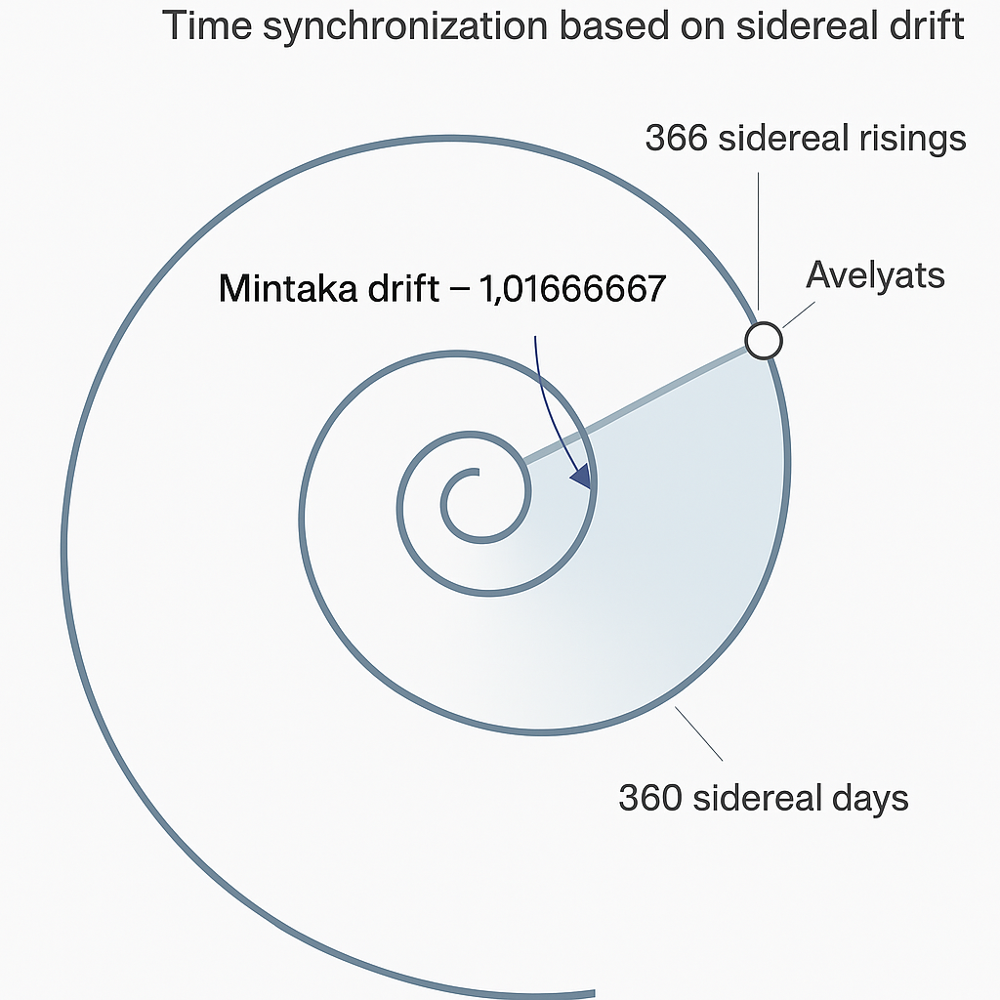
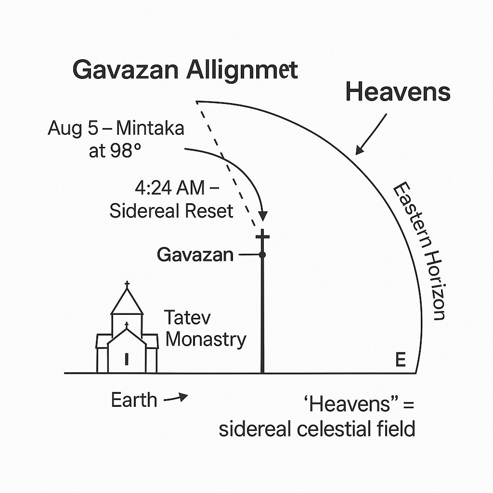
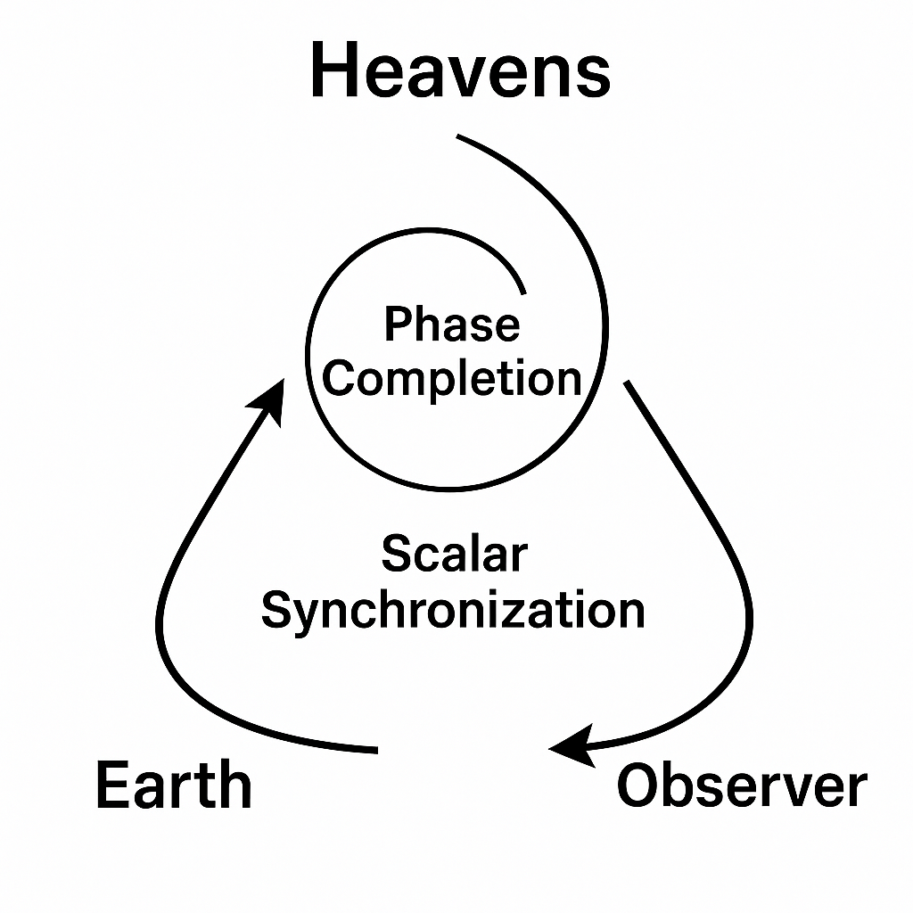
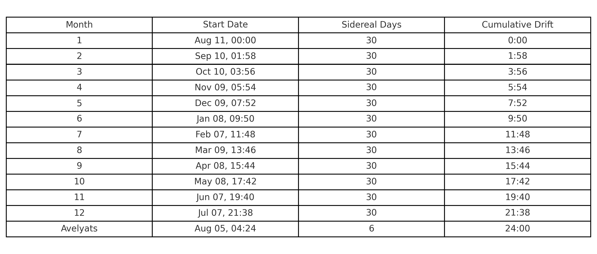

# 📘 Haykyan Boon Tomar (HBT) — Full Model

The **Haykyan Boon Tomar (HBT)** system presents a sidereal-solar calendar model based on the celestial mechanics of Orion (Hayk), integrating cosmic drift into a spiral framework of time. Below is the full scientific and symbolic structure of the model.

---

## 1. Presentation of the Haykyan System

HBT offers an alternative framework for measuring time using **sidereal (stellar) cycles**. It eliminates the need for leap years by encoding sidereal drift into a **spiral structure**, rather than a linear correction system.

> The model emerges from over 20 years of comparative research in calendar systems, field astronomy, biospheric data, and symbolic anthropology.

---

## 2. The Spiral View of Time

Time is not a straight succession of events, but a **spiral of interlinked cycles**, calibrated through stellar and solar observations.

> “Time does not repeat; it spirals upward.”

---

## 3. Orion (Hayk) as Anchor

In Armenian cosmology, **Hayk = Orion**. He is both mythic ancestor and celestial axis. Orion is not symbolic — it is the *mechanism* for cosmic timekeeping.

- **Mintaka (δ Orionis)** = Sidereal Start  
- **Betelgeuse (α Orionis)** = Reset Marker  
- **Azimuthal alignments** occur at Tatev Monastery

---

## 4. Key Terms

- **HBT**: *Haykyan Boon Tomar* — “Original Calendar of Hayk”  
- **Sidereal**: Star-based celestial time  
- **Solar**: Sun-based seasonal time  
- **Spiral Constant**: `1.01666667` = `366 / 360`

---

## 5. Celestial & Geographic Anchors

### 🌟 Primary Stars
| Star         | Date/Time          | Azimuth   |
|--------------|--------------------|-----------|
| Mintaka      | Aug 11, 04:00 AM   | 98°       |
| Betelgeuse   | Aug 5, 04:00 AM    | 90°       |

### 🌍 Earth Anchor
**Tatev Monastery, Armenia**
- Latitude: 39.38° N  
- Longitude: 46.26° E  
- Azimuth (Sunrise on Aug 5): 67.5°

---

## 6. Mintaka & the Spiral Constant

- Mintaka rises ~4 minutes earlier per day  
- 4 min × 360 = 24 hours → defines **1 sidereal day gain**

Thus:

| Cycle          | Length              |
|----------------|---------------------|
| Sidereal Year  | 360 sidereal days   |
| Solar Year     | 365.2 solar days    |
| Mintaka Risings | 366 per year       |
| Spiral Constant | `1.01666667`       |

**Acoustic Parallels**:
- `441 Hz × 1.01666667 = 448.35 Hz`  
- `441 Hz ÷ 1.01666667 ≈ 433.77 Hz`

  
*Figure: Mintaka's 366 risings over 360 sidereal days form a spiral drift. The Avelyats phase completes the loop.*

---

## 7. Tatev & the Gavazan

- **Gavazan**: 8.3m octagonal column with 12 symbolic segments  
- Alignments:
  - Aug 5, 04:24 AM — Mintaka sets the **Zero Hour**  
  - Aug 11, 04:00 AM — Mintaka rises for **New Year**

Tatev is located at a biospheric energy node:
- No Hartmann grid interference
- High measured well-being for humans and plants

  
*Figure: Vertical alignment of Mintaka over Gavazan at 4:24 AM on August 5 (Azimuth 98°).*

---

## 8. Observer Role

The HBT model places **human consciousness** as the final element of synchronization:

> “Consciousness harmonizes the spiral. Presence completes the rhythm.”

### Triadic Alignment:
1. **Earth** – physical position  
2. **Heavens** – celestial star and solar coordinates  
3. **Observer** – aware participant and resonance tuner

  
*Figure: Earth, Heavens, and Observer form the scalar synchronization loop.*

> **Note:** *“Heavens”* refers to the **sidereal celestial sphere** — the dynamic stellar and solar field used for synchronization. Equivalent to “sky” in empirical astronomy, it retains symbolic meaning tied to Orion (Hayk), cosmic rhythm, and observer-based resonance.

---

## 9. Calendar Structure

- **12 months × 30 days** = 360 **sidereal days**  
- **6-day Avelyats phase** = spiral correction zone

  
*Figure: Full sidereal drift calendar with start times and cumulative offsets for each 30-day cycle.*

---

## 10. Avelyats — Time Outside Time

- Begins: **Aug 5, 04:24 AM** — Mintaka's 360th sidereal rise  
- Ends: **Aug 11, 04:00 AM** — Mintaka rises again  
- Sunrise: **Aug 5, 06:00 AM** at azimuth 67.5° (Tatev axis)  
- A natural 6-day **phase drift zone** — no leap year required

---

## 11. Navasard — The New Spiral

- **Navasard** = “New Opening” (Aug 11, 04:00 AM)
- Mintaka returns to the same azimuth/RA as the year before
- Not a reset — an **elevation** of time's spiral octave

> “Time is a spiral breath: inhale (Avelyats), exhale (Sidereal Year)”

---

## 12. Conclusion

HBT offers a living sidereal model that unites:

- Celestial mechanics  
- Spiral mathematics  
- Observer consciousness  

It bridges ancient timekeeping with modern cosmology.

> **“To inhabit time is to awaken it.”**

---

*For full sidereal charts, azimuthal tracking tools, and collaborative inquiries, see additional materials in `/docs/` or contact the [THFX Project](https://www.thfxproject.com).*

