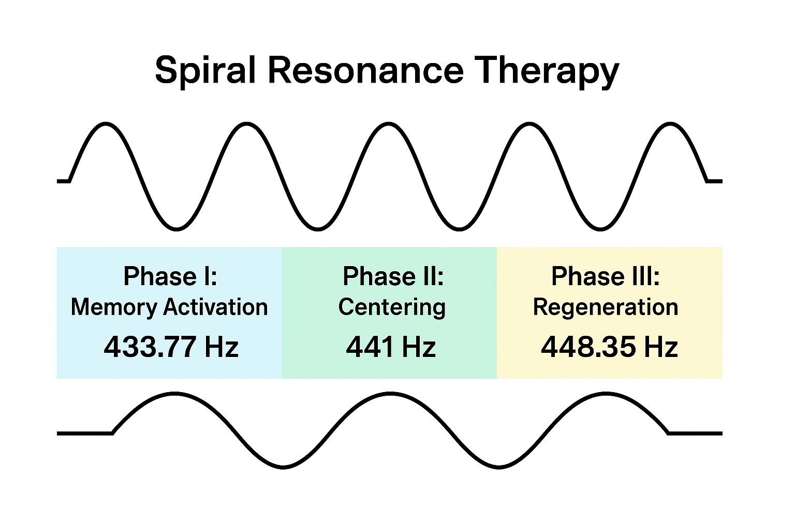

# 🎵 Spiral Resonance Therapy (SRT)

**Title:** Harmonic Restoration Through Sidereal-Solar Drift Alignment

Spiral Resonance Therapy (SRT) is a scalar-harmonic healing model derived from the Haykyan Boon Tomar (HBT) sidereal calendar. It uses precise frequency entrainment—tied to the spiral time constant—to restore coherence in biological and energetic systems.

---

## 🔹 Foundational Principle

The sidereal-solar drift constant governs both time and resonance:

This drift is integrated into SRT’s frequency structure to create a 3-phase therapeutic model.

---

## 🔁 Three-Phase Harmonic Protocol

### 1. **433.77 Hz** – Memory Activation & Emotional Grounding
- Derived by: `441 Hz ÷ 1.01666667`
- Effect: Cellular remembrance, ancestral imprint access, trauma softening
- Phase Tone: Regression ↔ Integration

### 2. **441 Hz** – Centering & Balance
- Universal harmonic standard used in sidereal coordination
- Effect: Midline stabilization, energetic coherence, clarity
- Phase Tone: Present ↔ Equilibrium

### 3. **448.35 Hz** – Elevation & Regeneration
- Derived by: `441 Hz × 1.01666667`
- Effect: Cellular uplift, repair, and regenerative activation
- Phase Tone: Expansion ↔ Renewal

  
*Figure: Three-phase resonance protocol—433.77 Hz, 441 Hz, 448.35 Hz.*

---

## 🧬 Biological Resonance and Sidereal Coherence

The therapy is structured to mirror the sidereal-solar relationship:
- **Drift** = healing window
- **Spiral progression** = cellular entrainment
- **0.5 Phase Threshold** = gateway between memory and regeneration

Each frequency anchors a phase of the **scalar field loop** within the body, mimicking:
- Drift → Resonance → Restoration

---

## 📊 Frequency Chart

| Phase | Frequency (Hz) | Function                        | Calculation             |
|-------|----------------|----------------------------------|-------------------------|
| I     | 433.77         | Memory, grounding               | 441 ÷ 1.01666667        |
| II    | 441.00         | Centering, balance              | Base harmonic           |
| III   | 448.35         | Elevation, regeneration         | 441 × 1.01666667        |

---

## 🌿 Applications

SRT is being explored in:
- Bioenergetic sound therapy
- Scalar wave frequency medicine
- Trauma resolution and somatic alignment
- Sleep and circadian recalibration

Each protocol is administered with intention, breathwork, and observer alignment to maximize resonance.

Spiral Constant = 1.01666667 = 366 ÷ 360

## 🧠 Scalar and Sidereal Synchronization

Each frequency phase represents a segment of the **spiral memory field**:
- 433.77 Hz = Past | Memory | Reflection
- 441 Hz = Present | Witness | Harmony
- 448.35 Hz = Future | Expansion | Renewal

By engaging all three, SRT invokes **temporal coherence** within the body and the field.

> "When the spiral breathes through you, regeneration begins."

---

## 🌌 Closing Thesis

SRT is not just vibrational therapy—it is spiral alignment therapy. It encodes sidereal time drift into acoustic form, allowing human biology to entrain with cosmic rhythm and scalar harmony.

---

*For context, see [`HBT_Model.md`](./HBT_Model.md) and [`Scalar_UFT.md`](./Scalar_UFT.md).*
