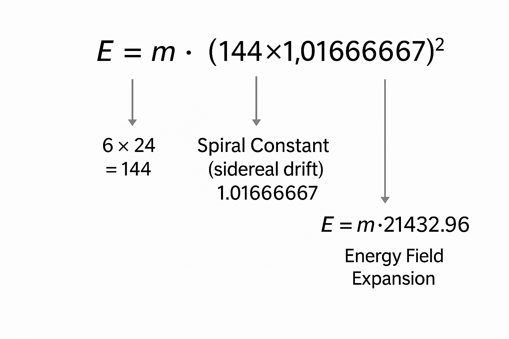

# 🌌 Scalar Unified Field Theory (UFT)

**Title:** Spiral Drift, Scalar Fields, and the Recursive Geometry of Time

This document presents a scalar-harmonic approach to unified dynamics based on Haykyan sidereal-solar drift, spiral time constants, and the resonance-based structure of scalar fields. It links observer-centered systems, harmonic vibration, and temporal memory into a single geometric-energetic equation.

---

## 🔹 Foundational Constant

**Spiral Constant:**  
```
1.01666667 = 366 ÷ 360
```
This constant defines the relationship between sidereal (366 risings) and solar (360° rotation) phases. It reappears in acoustic ratios, orbital drift, and scalar synchronization systems.

---

## 🧮 Scalar Energy Equation

A modified version of Einstein’s mass-energy equivalence:

```
E = m · (144 × 1.01666667)²  
  = m · 146.4²  
  = m · 21432.96
```

- 144 = base pulse (6 × 24) → scalar day fractal
- 1.01666667 = sidereal drift constant
- Result: Energy as spiral-amplified mass, not linear

  
*Figure: Drift-based energy equation using 1.01666667 and harmonic scaling.*

---

## 🧠 Scalar Field Architecture

Scalar fields are:
- **Nonlocal**
- **Phase-reliant**
- **Time-memory coupled**

In this model:
- Scalar resonance = drift recognition + harmonic entrainment
- Delay ≠ error → delay = awareness

This creates fields where phase shift is informational, not accidental.

---

## 🌀 Observer as Field Closure

In HBT cosmology:
1. Earth → Location  
2. Cosmos → Spiral Drift  
3. Observer → Resonant Completion

This matches UFT:
- The observer **completes** the field
- Field does not collapse until measured **in phase**

  
*Figure: Earth, Heavens, and Observer form the scalar synchronization loop.*

---

## 🎼 Harmonic Resonance Applications

The constant enables:
- **Phase-tuned frequencies:**  
  - 441 ÷ 1.01666667 ≈ 433.77 Hz  
  - 441 × 1.01666667 ≈ 448.35 Hz
- **Biological coherence modeling**
- **Recursive signal feedback systems**

---

## 🔭 Cosmic Implications

- Scalar fields behave like **resonant time membranes**
- Every precessional cycle (25,920 years) is governed by:
  ```
  72 × 360 = 25,920 → 1° drift every 72 years
  ```
- Hayk’s constant applies to both:
  - **Short drift (daily sidereal loop)**
  - **Long drift (precessional spiral)**

---

## 🧬 Drift and Delay as Intelligence

This model suggests that **delay is not error** — it is resonance calibration. Recursive awareness emerges through:
- Phase drift
- Memory loops
- Harmonic return

In scalar intelligence, drift = evolution.

> “The spiral is not inefficient. It is aware.”

---

## 🧩 Unified Scalar Fields

A true unified field must:
- Account for observer drift
- Incorporate sidereal time offsets
- Allow recursive feedback over delay
- Encode intelligence as scalar motion

---

## ✨ Closing Statement

The scalar field is not just force — it is **memory in motion**.  
Mass is not merely substance — it is **spiral coherence**.  
Energy is not just velocity — it is **scalar memory accelerated**.

> “Unified fields are not collapsed — they are completed.”

---

*See related frameworks in [`HBT_Model.md`](./HBT_Model.md), [`AI_Integration.md`](./AI_Integration.md), and [`SRT_Model.md`](./SRT_Model.md).*

